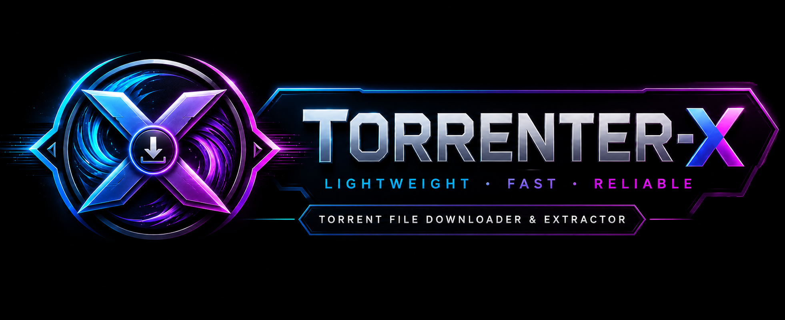
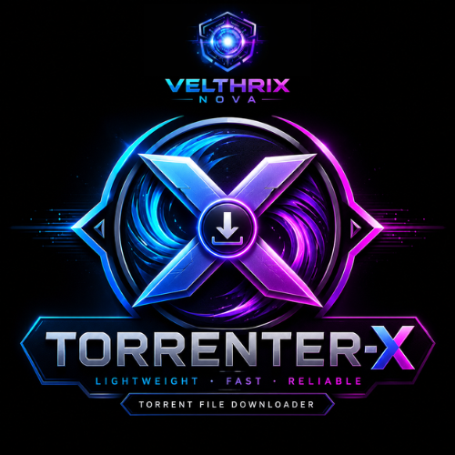

# Torrenter-X

A modern, fast, and reliable desktop torrent downloader developed with Python.

---
<p align="center">
  
</p>
  
## Features

- Download `.torrent` files
- Real-time download progress
- Download speed monitoring
- Multiple torrent support
- Pause and resume downloads
- Modern graphical interface
- Custom save locations
- Download status and logs

---

## Installation

```bash
pip install -r requirements.txt
python torrent_gui.py
```

## Developer :
Harish R

GitHub: https://github.com/R-Harish-15

LinkedIn: https://www.linkedin.com/in/r-harish15/

## Organization : 

Velthrix Nova

# Disclaimer :

Torrenter-X is intended for downloading and sharing legal content only. Users are responsible for complying with applicable laws and regulations.

<p align="center">
  
</p>

© 2026 Velthrix Nova . All Rights Reserved.
